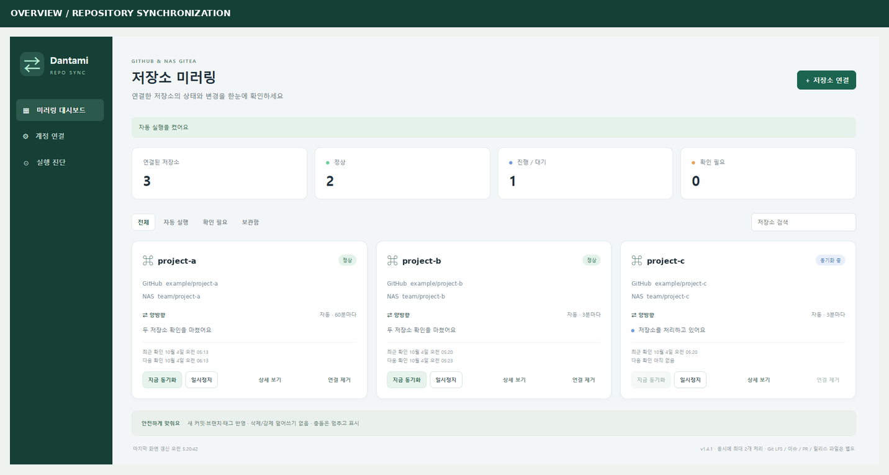
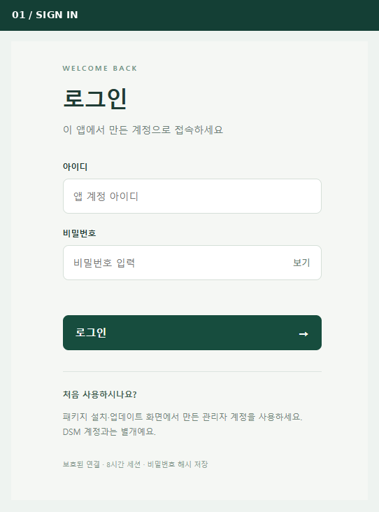
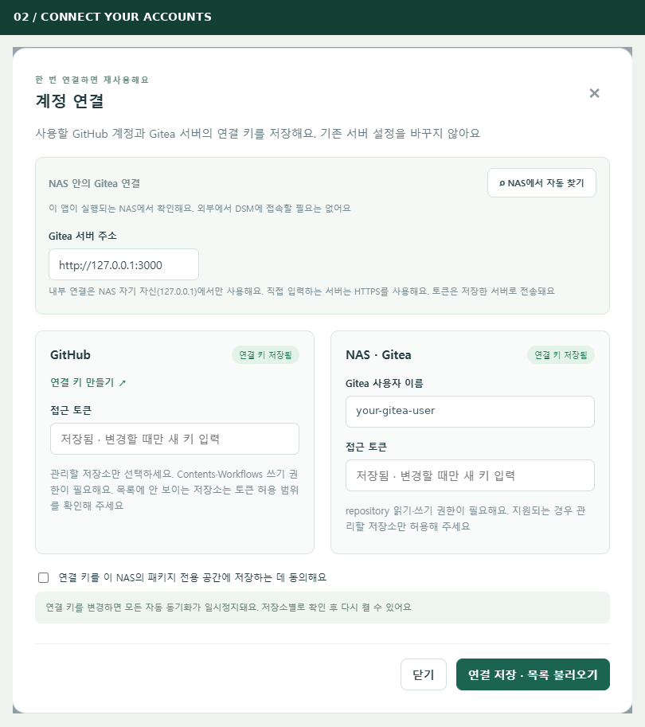
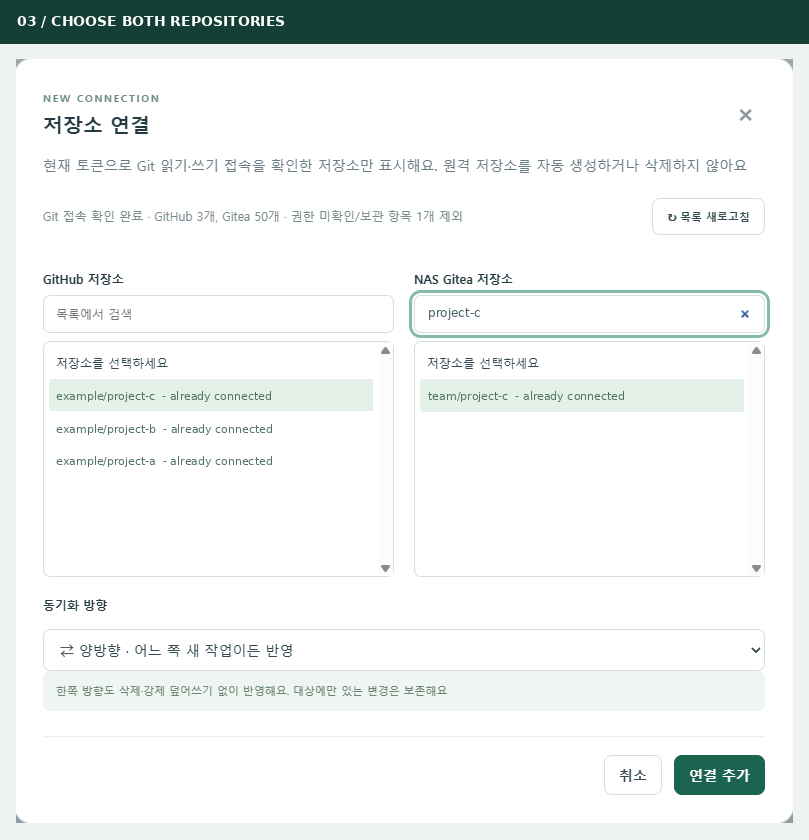
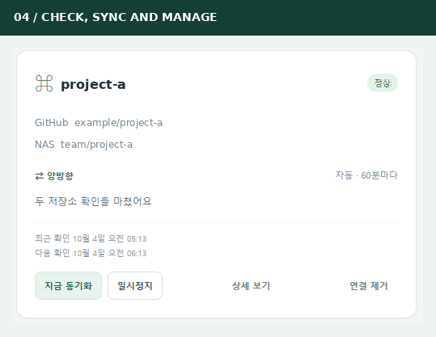
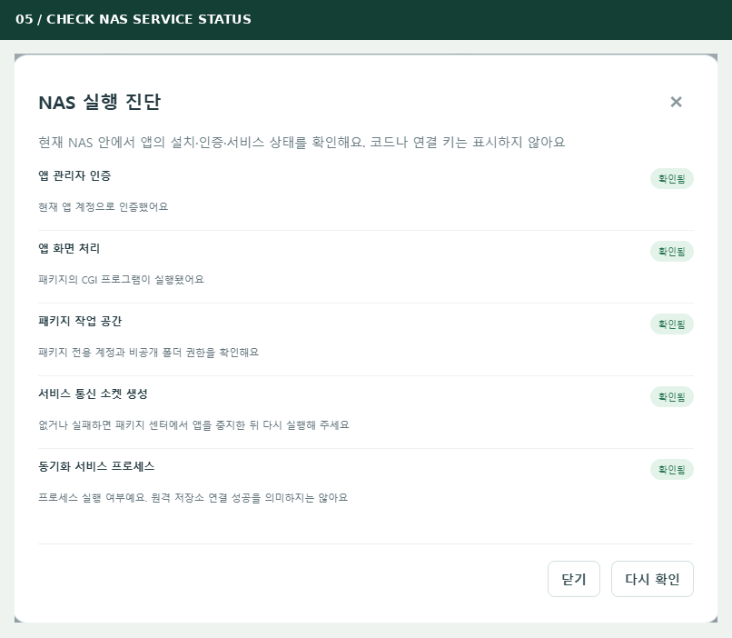

# Dantami Repo Sync

[English](README.md) · **한국어** · [설치파일 다운로드](https://github.com/momopanda123/dantami-repo-sync/releases/latest) · [전체 버전 이력](https://github.com/momopanda123/dantami-repo-sync/releases)

시놀로지 NAS에서 GitHub와 Gitea 저장소를 연결하고, 차이를 확인한 뒤 자동으로 동기화하는 앱입니다.



> 실제 사용 중 촬영한 v1.4.1 한국어 화면을 필요한 부분만 잘라 사용했습니다. 계정·저장소 이름은 예시로 바꿨으며 토큰 값은 노출하지 않았습니다. v1.5.0부터 추가된 한/영 선택기는 이 이전 버전 스크린샷에는 없습니다.

## 시작 전에 준비하세요

- **DSM 7 · Intel/AMD x86_64 시놀로지 NAS**와 HTTPS 접속
- 서로 연결할 기존 GitHub 저장소와 Gitea 저장소
- 각 서비스의 접근 토큰
- 양방향으로 맞출지, 한쪽을 원본으로 삼을지 결정하고 변경 내용 확인

**계정은 세 가지 역할이 달라요.** 앱에 로그인할 때는 **설치 중 만든 앱 계정**, GitHub 연결에는 **GitHub 토큰**, Gitea 연결에는 **Gitea 사용자 이름과 토큰**을 사용합니다. DSM 비밀번호를 앱 로그인에 넣는 것이 아닙니다.

## 1. 설치하고 앱에 로그인하세요

1. [최신 릴리즈](https://github.com/momopanda123/dantami-repo-sync/releases/latest)의 **Assets**에서 `.spk`를 내려받습니다.
2. DSM의 **패키지 센터 → 수동 설치**에서 파일을 선택합니다. 기존 설치는 제거하지 않고 업데이트합니다.
3. 처음 표시되는 설치 안내에서 **앱 관리자 아이디와 비밀번호**를 직접 만듭니다.
4. HTTPS로 앱을 열고 방금 만든 앱 계정으로 로그인합니다.
5. v1.6.2 이상은 **설정 / Settings**에서 **한국어 / English**를 고르고 **설정 저장**을 누릅니다. 로그인 화면에서는 언어 선택기를 사용합니다. 선택은 현재 브라우저에 저장됩니다.



**성공하면:** 대시보드가 열립니다. 새로 설치한 앱의 저장소 목록은 비어 있습니다. 업데이트할 때는 기존 앱 계정을 유지합니다.

## 2. GitHub와 Gitea 토큰을 각각 만드세요

### GitHub 토큰

1. [Fine-grained 토큰 발급 화면](https://github.com/settings/personal-access-tokens/new)을 엽니다.
2. 이름은 **Dantami Repo Sync**처럼 알아보기 쉽게 입력하고 만료일을 정합니다.
3. **Resource owner**에서 실제 저장소 소유자를 선택합니다.
4. **Repository access → Only select repositories**에서 동기화할 저장소를 선택합니다.
5. **Contents → Read and write**를 부여합니다. `.github/workflows` 파일까지 동기화한다면 **Workflows → Read and write**도 추가합니다.
6. **Generate token**을 누르고 나온 값을 복사해 앱의 GitHub 접근 토큰 칸에 붙여넣습니다.

### Gitea 토큰

1. **자신의 Gitea 서버**에서 **설정 → 애플리케이션**(`/user/settings/applications`)을 엽니다.
2. **새 토큰 생성**에서 이름을 입력하고 **repository → 읽기 및 쓰기**를 선택합니다. 비공개 저장소라면 비공개 접근도 허용하는 범위를 선택합니다.
3. 생성된 값을 복사해 앱의 Gitea 접근 토큰 칸에 붙여넣습니다. Gitea 버전에 따라 화면 이름은 조금 다를 수 있습니다.

> Gitea의 일반 개인 토큰은 GitHub의 ‘선택한 저장소만’과 달리 계정이 가진 저장소 권한을 기반으로 합니다. 한 저장소로 엄격히 제한하려면 전용 Gitea 계정에 필요한 저장소의 쓰기 권한만 부여하고 그 계정의 토큰을 사용하세요. 앱에서 목록을 숨기는 것만으로 토큰의 실제 권한이 줄어들지는 않습니다.

토큰은 생성 직후 한 번만 표시될 수 있습니다. 실제 토큰을 이슈·스크린샷·README에 올리지 마세요.

## 3. 두 서비스의 연결 정보를 저장하세요

왼쪽 메뉴의 **계정 연결**을 엽니다.



1. `https://git.example.com`처럼 **자신의 Gitea 서버 주소**와 **Gitea 사용자 이름**을 입력합니다.
2. GitHub·Gitea 각각의 **접근 토큰** 칸에 해당 토큰을 넣습니다.
3. **NAS의 패키지 전용 공간에 저장하는 데 동의**하는 항목을 체크합니다.
4. **연결 저장 · 목록 불러오기**를 누릅니다.

**성공하면:** ‘연결 키 저장됨’ 표시가 나오고 접근 확인을 마친 저장소 목록을 불러옵니다.

**화면의 내부 주소 주의:** `127.0.0.1`은 내 PC가 아니라 이 앱이 실행되는 NAS 자신을 뜻합니다. **NAS에서 자동 찾기**로 확인된 내부 연결을 선택하거나 자신의 HTTPS 주소를 입력하세요. 예시 주소를 그대로 따라 넣는 방식이 아닙니다. 이미 저장된 토큰 칸은 변경할 때만 다시 입력합니다.

## 4. 양쪽 저장소를 짝지으세요

오른쪽 위 **저장소 연결**을 누릅니다.



1. 필요하면 **목록 새로고침**을 누릅니다.
2. 왼쪽에서 GitHub 저장소, 오른쪽에서 연결할 Gitea 저장소를 선택합니다. 양쪽 이름이 반드시 같을 필요는 없습니다.
3. 동기화 방향을 선택합니다.
   - **양방향:** 어느 쪽에서 생긴 새 작업이든 반대쪽으로 반영 검토
   - **GitHub → NAS:** GitHub를 원본으로 사용
   - **NAS → GitHub:** NAS의 Gitea를 원본으로 사용
4. **연결 추가**를 누릅니다.

**성공하면:** 대시보드에 새 카드가 생기며 자동 실행은 아직 꺼져 있습니다.

스크린샷의 ‘연결됨’ 항목들은 이미 사용 중인 예시입니다. 새 연결에는 아직 연결하지 않은 저장소를 선택해야 합니다. GitHub 토큰이 한 저장소만 허용하면 확인된 해당 후보만 표시되어야 하며, 계정 전체 권한인 Gitea 토큰에는 여러 저장소가 나올 수 있습니다.

## 5. 먼저 확인하고 자동 동기화를 켜세요

새 카드에서 **연결 확인**을 누릅니다. 원격 저장소를 바꾸지 않고 차이를 비교하므로 **상세 보기**에서 결과를 검토한 뒤 자동 실행을 켜세요.



이 화면은 확인을 끝내고 자동 실행을 켠 상태라 **지금 동기화 / 일시정지**가 표시됩니다. 처음에는 **연결 확인 / 자동 실행 켜기**부터 진행합니다.

| 버튼·상태 | 의미 |
| --- | --- |
| 연결 확인 | 원격 저장소를 변경하지 않고 비교 |
| 지금 동기화 | 즉시 동기화 요청 |
| 자동 실행 켜기 / 일시정지 | 예약 작업 시작 또는 중지 요청 |
| 상세 보기 | 브랜치·태그 결과, 충돌, 기록, 방향·주기 확인 |
| 연결 제거 | 확인 후 앱 설정·캐시·기록만 제거하며 원격 저장소는 유지 |
| 정상 | 완료된 확인에서 연결 상태가 정상으로 판정됨 |
| 확인 필요·충돌 | 문제가 있는 항목을 검토해야 하며 강제 덮어쓰지 않음 |

서비스 재시작·업데이트 후에는 자동 실행이 켜진 연결을 먼저 비교하고, 안전하게 반영할 변경이 있으면 설정 간격을 기다리지 않고 바로 동기화합니다. 동기화가 끝난 뒤부터 기존 주기로 실행됩니다. 직접 누른 **연결 확인**은 비교만 합니다.

NAS와 패키지가 실행 중이어야 예약 동기화가 동작합니다. 브라우저를 닫아도 서비스는 계속 실행됩니다. 서로 갈라진 브랜치와 다른 내용의 태그는 검토가 필요하며, 원격 삭제·강제 푸시·임의 자동 병합은 하지 않습니다.

## 문제가 생겼을 때

왼쪽 **실행 진단**에서 앱 서비스와 비공개 작업 공간을 확인합니다.



| 증상 | 먼저 확인할 항목 |
| --- | --- |
| 로그인 실패 | 설치 중 만든 앱 계정인지, HTTPS로 접속했는지 확인 |
| 저장소가 목록에 없음 | 토큰 허용 범위·만료일 확인 후 목록 새로고침 |
| Gitea 저장소가 많이 나옴 | 계정 전체 권한이라면 정상일 수 있으므로 계정 권한 확인 |
| 토큰 저장 후 연결 실패 | 서버 주소·인증서·NAS 네트워크·토큰 권한 확인 |
| 충돌 표시 | 상세 보기에서 브랜치·태그 확인; 자동 병합하지 않음 |
| 진단은 통과했는데 동기화 실패 | 로컬 서비스 정상과 원격 저장소 접근은 별개이므로 토큰/저장소 오류 확인 |

문의할 때는 앱 버전, 막힌 단계, 오류 문구를 알려주세요. 토큰·계정명·개인 서버 주소·비공개 저장소 이름은 가려주세요.

---

## 설정

v1.6.2부터 왼쪽 메뉴의 **설정 / Settings**를 누릅니다. 작은 화면에서도 메뉴가 표시됩니다.

- **언어:** 한국어 / English를 고르고 **설정 저장**을 누르면 화면이 다시 열립니다. 로그인 화면의 언어 선택도 유지됩니다.
- **화면 새로고침:** 기본 4초, 10/30/60초 또는 수동을 선택합니다. 상단 **새로고침** 버튼으로 언제든 갱신할 수 있습니다. 화면 조회 간격만 바뀌며 NAS 자동 동기화는 계속 실행됩니다.
- **새 연결 기본값:** 동기화 방향과 자동 확인 간격을 지정합니다. 새 저장소 연결 화면에 미리 선택되며 그 화면에서 다시 바꿀 수 있습니다. 기존 연결은 변경하지 않고, 새 연결도 확인 후 자동 실행을 직접 켜야 합니다.
- **기본값 불러오기:** 입력란만 기본값으로 채웁니다. **설정 저장**을 눌러야 적용됩니다. 취소·닫기·Escape로 닫으면 저장하지 않습니다.
- **앱 정보:** 설치 버전을 표시합니다. 앱 계정·비밀번호와 서비스 토큰은 기존 계정 메뉴에서 관리합니다.

환경설정은 이 브라우저에만 저장되며 다른 기기와 공유하지 않습니다. 언어 쿠키는 최대 1년 동안 유지되지만 브라우저 개인정보 설정에 따라 먼저 지워질 수 있습니다. 이 설정에 토큰·비밀번호는 저장하지 않습니다. 저장이 차단된 브라우저에서는 실패 안내를 표시합니다.

아래의 v1.4.1 스크린샷에는 이 메뉴가 없습니다. 설정 메뉴를 사용하려면 SPK를 v1.6.2으로 업데이트하세요.

<details>
<summary>상세 동작 · 보안 · 개발 방법 · 라이선스</summary>

## 사용자와 권한

계정 관리에서 내 비밀번호 변경 및 관리자에 의한 사용자 추가·비활성화·활성화·비밀번호 재설정·삭제를 지원합니다.
관리 작업은 관리자 본인의 현재 비밀번호를 다시 확인합니다.
관리자는 연결·설정·동기화를 제어합니다. 조회자는 같은 대시보드를 읽기만 합니다. 사용자별 독립 저장소 공간은 아닙니다.
자기 관리자 계정의 삭제/비활성화는 막습니다. 다른 관리자가 있는지 확인하고 계정을 관리하세요.
이메일 비밀번호 복구와 공개 회원가입은 제공하지 않습니다.

비밀번호는 bcrypt(cost 12) 해시만 저장합니다. 세션 쿠키는 Secure/HttpOnly/SameSite=Strict이며 8시간 후 만료됩니다.
로그아웃·계정 비활성화·비밀번호 변경 시 관련 세션이 무효화됩니다. 서비스 재시작 시 다시 로그인해야 합니다.
로그인 시도 제한, 동일 출처 검사 및 변경 요청 CSRF 검사를 적용합니다.
DSM 로그인 API와 관리자 인증은 사용하지 않습니다. DSM은 설치·실행·웹 경로 제공에만 사용됩니다.

## 저장소 연결

계정 연결에서 Gitea HTTPS 서버 루트 주소와 Gitea 사용자 이름, GitHub/Gitea 접근 토큰을 입력합니다.
새 설치는 빈 목록이며 개인 주소·계정·저장소 기본값이 없습니다.
NAS 내부 Gitea는 자동 탐색된 127.0.0.1 연결을 선택할 수도 있습니다. 그 외 HTTP 서버, URL 하위 경로 설치는 지원하지 않습니다.
토큰은 사용자가 지정한 해당 서비스로만 보냅니다. 서버 변경 시 Gitea 토큰을 다시 입력해야 합니다.
두 서비스의 저장소 목록에서 쌍을 추가 → 연결 확인 → 자동 실행 켜기 순으로 사용합니다.

## 연결 관리

검색·상태 필터·상세·간격/방향 변경·일시정지·보관/복원·연결 제거를 지원합니다.
연결 제거는 사용자 확인 후 앱의 연결 설정·내부 캐시·검사 기록만 지웁니다. 원본 원격 저장소는 지우지 않습니다.
제거 후 다시 등록하면 이전 삭제 감지 기록 없이 새로 확인해야 합니다.
이전 버전의 자동 등록 항목은 업그레이드 시 비공개 공간에 한 번 백업하고 목록에서 분리합니다. 사용자가 추가한 연결은 유지합니다.

## 동기화 범위

커밋 조상 관계로 비교하며 원격 삭제·강제 푸시·임의 자동 병합은 하지 않습니다. 갈라진 브랜치/다른 태그는 검토가 필요합니다.
한쪽 방향도 지원합니다. 동시에 최대 두 작업을 처리합니다.
Git LFS 데이터, 이슈, PR, 릴리스 첨부, 서브모듈 저장소는 지원 대상이 아닙니다. LFS 포인터는 자동 반영을 중지합니다.

## 개발

Go 1.27.1 이상, Python 3 + Pillow, 테스트용 Git CLI가 필요합니다.

```sh
mkdir -p .agents dist
python3 generate-locales.py
go test -race ./...
go vet ./...
CGO_ENABLED=0 GOOS=linux GOARCH=amd64 go build -trimpath -ldflags='-s -w' -o .agents/repo-sync .
go list -m -json all > .agents/modules.json
python3 build-package.py
```

설정과 비밀번호 해시·토큰은 NAS의 패키지 비공개 공간에만 저장합니다. 런타임 폴더를 공개 저장소에 포함하지 마세요.
공개 소스에는 테스트용 가짜 계정 값만 있고 실행 중인 계정/서버 설정·로그·과거 Git 이력이 없습니다.
의존성 라이선스는 SPK에 포함되며 프로젝트는 [MIT 라이선스](LICENSE)로 배포됩니다.

## 검증 한계

로컬 계정/세션/권한/CSRF/로그인 제한, Git 동기화 및 DOM 동작 검사 등을 수행합니다.
실제 DSM 설치 마법사, CGI 실행 계정/소켓 접근, 사용자 브라우저의 렌더링과 실제 원격 동기화는 별도 확인이 필요합니다.
이전 버전의 DSM 인증 검증 결과를 이 버전의 앱 계정 로그인 성공으로 간주하지 않습니다.

## 저장소 목록의 접근 확인

API의 저장소 목록이나 계정의 permissions.push 값만으로 토큰 권한을 단정하지 않습니다.
각 후보에 대해 현재 토큰으로 Git upload-pack / receive-pack 광고를 GET으로 읽고, 유효한 Git 응답이 확인된 저장소만 목록에 올립니다.
등록 직전에도 해당 토큰의 연결을 다시 확인합니다. 오래된/확인 중인 목록이나 확인 실패 항목은 등록하지 않습니다.
검사 중에는 POST, 커밋, 브랜치 변경 등 원격 쓰기를 수행하지 않습니다. 새로고침 실패 시 이전 목록을 재사용하지 않습니다.
목록은 양쪽 읽기·쓰기 토큰을 사용하는 이 앱의 설정 기준입니다. 읽기 전용 토큰은 단방향 원본 용도라도 현재 후보에서 제외됩니다.
이 검사는 토큰 설정 화면의 선택 목록을 직접 읽는 것이 아니며, 브랜치 보호·워크플로별 권한·후속 정책으로 실제 푸시는 거부될 수 있습니다.
서버가 토큰에 계정 전체 저장소 권한을 부여했다면 여러 저장소가 확인될 수 있습니다.

## 한국어 / 영어

로그인 화면과 대시보드 오른쪽 위에서 한국어 또는 English를 선택할 수 있습니다.
선택은 현재 브라우저에 저장되며 오류·상태·동기화 결과 메시지도 함께 전환됩니다.
언어 변경은 페이지를 새로 불러오며 저장하지 않은 비밀번호/토큰 입력이 있으면 확인합니다.
설치 마법사에는 한국어와 영어 안내가 포함됩니다.
번역은 web/i18n.json에서 관리하고 generate-locales.py로 영어 자산을 생성합니다. 누락된 번역은 생성 단계에서 오류로 처리합니다.

## 라이선스

[MIT](LICENSE) · Copyright © 2026 momopanda123

</details>
